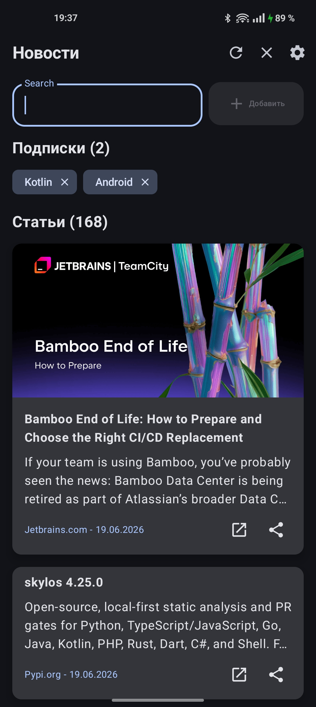
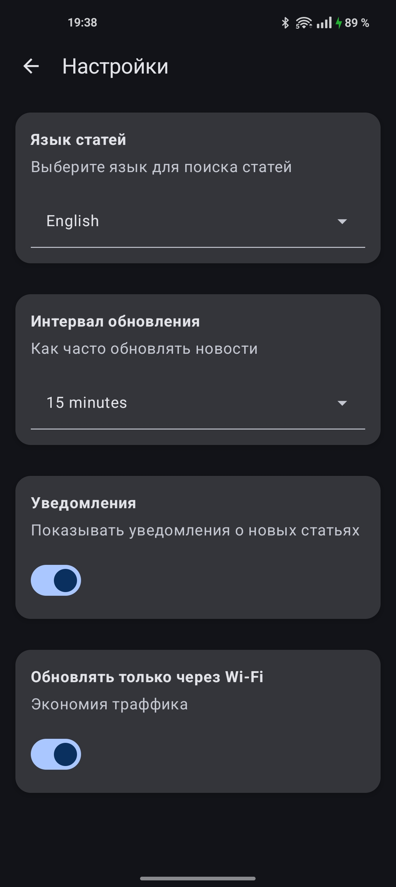

# News Android App
Приложение с новостями для Android, разработанное на самом современном стеке технологий.

## Возможности

*   **Управление подписками:** Добавляйте интересные вам темы и читайте новости по ним.
*   **Фоновое обновление данных:** Возможность в фоне загружать новые статьи по интересующим вас темам.
*   **Уведомления:** Получайте уведомления о новых статьях из ваших подписок.
*   **Поддержка нескольких языков для новостей:** Получайте новости на интересующем вас языке.
*   **Динамическая тема:** Тема приложения адаптируется к системной светлой или темной теме.

## Стек технологий и архитектура

*   **UI:** 100% [Jetpack Compose](https://developer.android.com/jetpack/compose)
*   **Архитектура:** MVI
*   **Асинхронное программирование:** [Kotlin Coroutines](https://kotlinlang.org/docs/coroutines-overview.html) и [Flow](https://kotlinlang.org/docs/flow.html)
*   **DI:** [Hilt](https://dagger.dev/hilt/)
*   **База данных:** [Room](https://developer.android.com/training/data-storage/room)
*   **Хранение настроек:** [DataStore](https://developer.android.com/jetpack/androidx/releases/datastore)
*   **Навигация:** [Jetpack Navigation для Compose](https://developer.android.com/jetpack/compose/navigation)
*   **Сеть:** [Retrofit](https://square.github.io/retrofit/)
*   **Работа в фоне:** [WorkManager](https://developer.android.com/develop/background-work/background-tasks/persistent/getting-started)

## Скриншоты

| Главный экран | Планирование |
| :---: | :---: |
|  |  |

## Скачать APK

* **[Скачать приложение](https://github.com/sbeu-uwu/News/releases/download/release/News.apk)**
